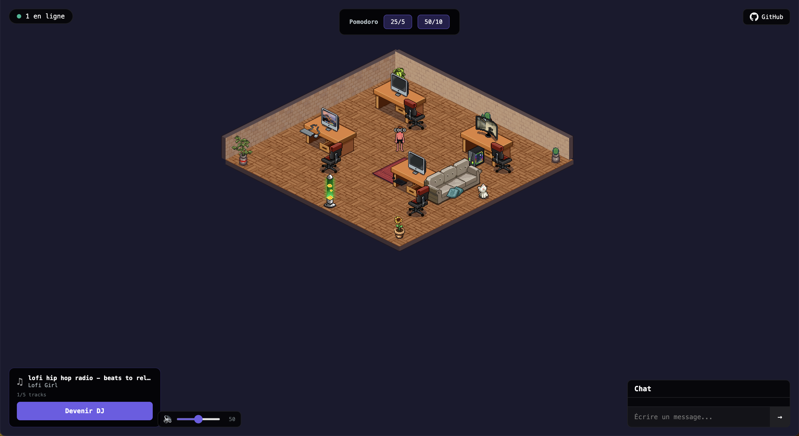

# Coco Working

**A digital co-working space with isometric pixel art.**

A virtual workspace inspired by Habbo Hotel where you can join a room, work alongside others, listen to music together, and run collective Pomodoro sessions.

100% browser-based. Nothing to install.



## Features

- **Isometric pixel art room** — furniture, desks, plants, animations (cat, lava lamp, screens)
- **Real-time multiplayer** — see other players move, chat, and work
- **DJ mode** — one player controls the music via YouTube (lo-fi playlists, custom links)
- **Collective Pomodoro** — focus sessions (25/5 or 50/10), chat disabled during focus
- **Chat** — real-time messages with bubbles above avatars
- **Proximity audio/video** — WebRTC infrastructure (PeerJS) for video when players get close
- **Animated characters** — pixel art sprites with walk/idle animations in 4 directions
- **Local audio control** — each player can mute/adjust their own volume

## Tech Stack

| Layer | Tech |
|---|---|
| Game engine | Phaser 3 |
| Frontend UI | React 19 + TypeScript |
| Real-time | Socket.IO |
| Video/Audio | PeerJS (WebRTC) |
| Music | YouTube IFrame API |
| Backend | Node.js + TypeScript |
| Tests | Vitest (unit + integration) |
| Monorepo | Turborepo + pnpm |
| Bundler | Vite |

## Quick Start

```bash
# Prerequisites: Node.js >= 20, pnpm

# Clone the repo
git clone https://github.com/cocolocow/cocoworking.git
cd cocoworking

# Install dependencies
pnpm install

# Start the server (terminal 1)
pnpm --filter @cocoworking/server dev

# Start the client (terminal 2)
pnpm --filter @cocoworking/client dev

# Open http://localhost:3000
```

## Tests

```bash
pnpm -w run test          # All tests (unit + integration)
pnpm -w run test:unit     # Unit tests only
pnpm -w run test:e2e      # E2E tests (Playwright)
```

## Project Structure

```
packages/
  client/          — Phaser 3 + React (Vite)
    src/
      scenes/      — CoworkingScene, RoomEditor, roomLayout.ts
      ui/          — React components (Lobby, Chat, DJPanel, PomodoroBar...)
      game-logic/  — NetworkManager, ProximityManager, YouTubePlayer
    public/
      assets/      — Pixel art sprites and tilesets
  server/          — Socket.IO server
    src/
      rooms/       — CoworkingServer (multiplayer, DJ, Pomodoro)
  shared/          — Types and pure logic (isometric, movement, proximity, DJ, Pomodoro)
```

## Assets

The pixel art assets used in this project are under commercial license and are **not** covered by the MIT license of the source code:

- **[Isometric Interiors Tileset](https://pixel-salvaje.itch.io/isometric-interiors)** by [@Pixel_Salvaje](https://pixel-salvaje.itch.io/) — furniture, floors, walls, decorations
- **[Isometric Character Animations Template](https://pixel-salvaje.itch.io/isometric-character-template-64-pixel-art)** by [@Pixel_Salvaje](https://pixel-salvaje.itch.io/) — character sprites with walk/idle animations

If you fork this project, you must purchase your own licenses for these assets.

## Useful Commands

| Command | Description |
|---|---|
| `pnpm -w run dev` | Start client + server |
| `pnpm -w run test` | Run all tests |
| `pnpm -w run build` | Production build |
| `pnpm --filter @cocoworking/client lint` | Type-check the client |
| `http://localhost:3000/?editor` | Open the room editor |

## Contributing

Contributions are welcome! See [CONTRIBUTING.md](CONTRIBUTING.md) for guidelines.

## Roadmap

- [ ] Multiple rooms (create/join different spaces)
- [ ] Custom characters (clothing, hair, accessories)
- [ ] Auth + persistent profiles
- [ ] In-game room editor (drag & drop furniture)
- [ ] Sound effects (footsteps, notifications, ambiance)
- [ ] Mobile support (touch controls)

## License

Source code: [MIT](LICENSE)

Pixel art assets: separate commercial licenses (see Assets section)

---

Built with love by [Coco](https://github.com/cocolocow) and [Claude Code](https://claude.com/claude-code)
